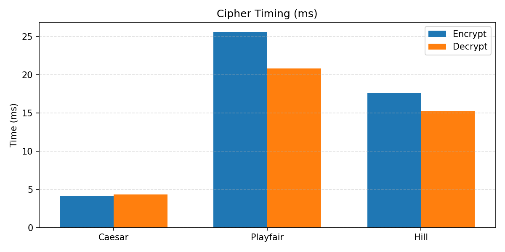

CyberSec ELC - Classic Cipher Toolkit
=====================================

This project demonstrates three classic ciphers (Caesar, Playfair, Hill), measures
encryption/decryption timing, and saves outputs plus a timing plot.

Features
--------
- Encrypt and decrypt using Caesar, Playfair, and Hill ciphers.
- Read plaintext from a file.
- Save per-cipher ciphertexts and a combined encrypted file.
- Generate a bar chart comparing encrypt/decrypt times.

Project Structure
-----------------
- Main.py - main script with cipher implementations and timing.
- Text_To_Be_Encypted_f13bb925bd874f6408405c41b4c6ab30.txt - input plaintext.
- cipher_caesar.txt, cipher_playfair.txt, cipher_hill.txt - per-cipher ciphertexts.
- encrypted_text.txt - combined encrypted output.
- timing_comparison.png - timing chart.

Requirements
------------
- Python 3.8+ (recommended)
- numpy
- matplotlib

Install dependencies:

```
pip install numpy matplotlib
```

How To Run
----------
Run the main script:

```
python Main.py
```

The script reads plaintext from:

```
/home/preet/CyberSecELC/Text_To_Be_Encypted_f13bb925bd874f6408405c41b4c6ab30.txt
```

If you want to change the input, update the `source_path` variable in Main.py.

Outputs
-------
- plaintext.txt - saved copy of the input text.
- cipher_caesar.txt - Caesar ciphertext.
- cipher_playfair.txt - Playfair ciphertext.
- cipher_hill.txt - Hill ciphertext.
- encrypted_text.txt - combined encrypted output.
- timing_comparison.png - bar chart of encrypt/decrypt times in milliseconds.

Timing Chart
------------


Theory Overview
---------------
Caesar cipher is a monoalphabetic substitution that shifts each letter by a fixed
number. It is simple and fast but easy to break with frequency analysis.

Playfair cipher is a digraph substitution that encrypts pairs of letters using a
5x5 key matrix. It obscures single-letter frequencies better than Caesar, but it
still has structural weaknesses.

Hill cipher is a polygraphic substitution using linear algebra. It groups letters
into vectors and multiplies them by a key matrix modulo 26. It provides stronger
diffusion than Caesar and Playfair, but key management and invertibility are
critical.

Algorithm Comparison
--------------------
| Cipher   | Type                      | Unit      | Key Type          | Strength (Relative) | Notes |
|---------|---------------------------|-----------|-------------------|---------------------|-------|
| Caesar  | Monoalphabetic substitution | 1 letter  | Integer shift     | Low                 | Easy to brute-force. |
| Playfair| Digraph substitution        | 2 letters | 5x5 letter matrix | Medium              | Hides single-letter frequency. |
| Hill    | Polygraphic substitution    | n letters | n x n matrix      | Medium to High      | Requires invertible matrix mod 26. |

Notes
-----
- Playfair and Hill ciphers operate on letters only. The current implementation
	removes spaces for those ciphers and pads as needed.
- Hill cipher requires an invertible key matrix modulo 26. A sample key is
	included in the script.

Troubleshooting
---------------
- If you see a matplotlib import error, install dependencies using the command
	above.
- If the input file path is missing, update `source_path` in Main.py.
